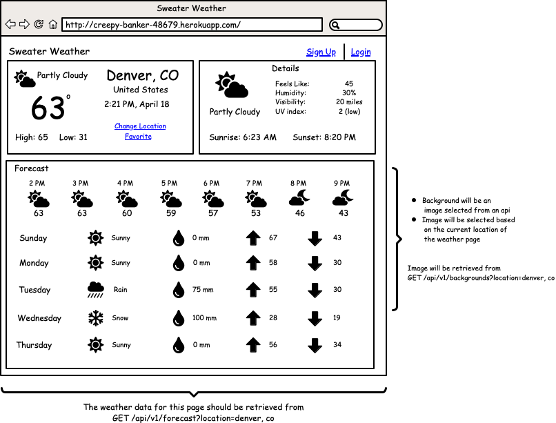

# Sweater Weather API [](https://travis-ci.org/kmcgrevey/sweater_weather_api)

## Description
**Sweater Weather API** is the back-end for a [Turing School of Software and Design](https://turing.io/) student project constructed to meet a fictional front-end team's wireframe and endpoint requirements. It exposes a weather API aggregated from four external APIs to provide current weather, forecast data and travel time for a road-trip destination.

## Wireframe Example
With no actual front-end for **Sweater Weather API**, this wireframe mockup would indicate typical information needed to populate the page:  



## Endpoints

See the Documentation: [Postman Endpoint Information](https://documenter.getpostman.com/view/11306597/TVCiV7aF)

#### Weather for a City
```
GET /api/v1/forecast?location=city,st
```
#### Background Image for a City
```
GET /api/v1/backgrounds?location=city,st
```
#### Registration
```
POST /api/v1/users
```
#### Login
```
POST /api/v1/sessions
```
#### Road Trip
```
POST /api/v1/road_trip
```


## Application Links

BE Production: https://km-sweater-weather-api.herokuapp.com/

## Local Setup Instructions

- Set environment variables (place in an `application.yml` file in the `config` folder)
  ```
  GOOG_GEO_API=<register for your own>
  OPENWX_API_KEY=<register for your own>
  ```
- NOTE: **Google Geocoding API** and **OpenWeather OneCall API** are being used currently
#### Starting Rails Server

- To run server on `localhost:3000/`:
  ```
  rails s
  ```

## Technologies and Frameworks

- Back-End
  - Language: Ruby 2.5.3
  - Framework: Rails 5.1.7
  - Testing: RSpec
  - Database: PostgreSQL
- CI/CD
  - Continuous Integration: TravisCI
  - Deployment: Heroku

